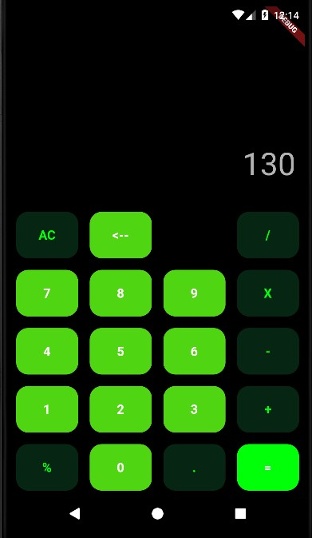
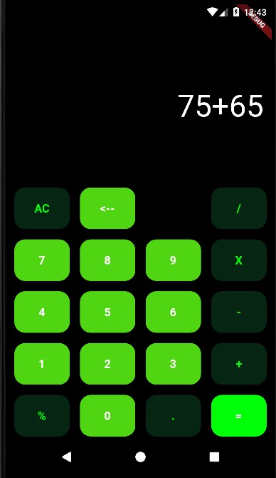

# calculator_flutter

Calculator is a simple and easy-to-use calculator app built using the Flutter framework. It features a clean and modern design, and includes basic mathematical operations such as addition, subtraction, multiplication, and division.
The app has a simple and intuitive user interface that makes it easy for users to input numbers and perform calculations. The app is built using the Flutter framework, which allows for the creation of high-performance, cross-platform mobile apps. The app can be easily customized and extended to add new features and functionality. Overall, the Calculator is a useful tool for anyone who needs to perform quick calculations on the go.

